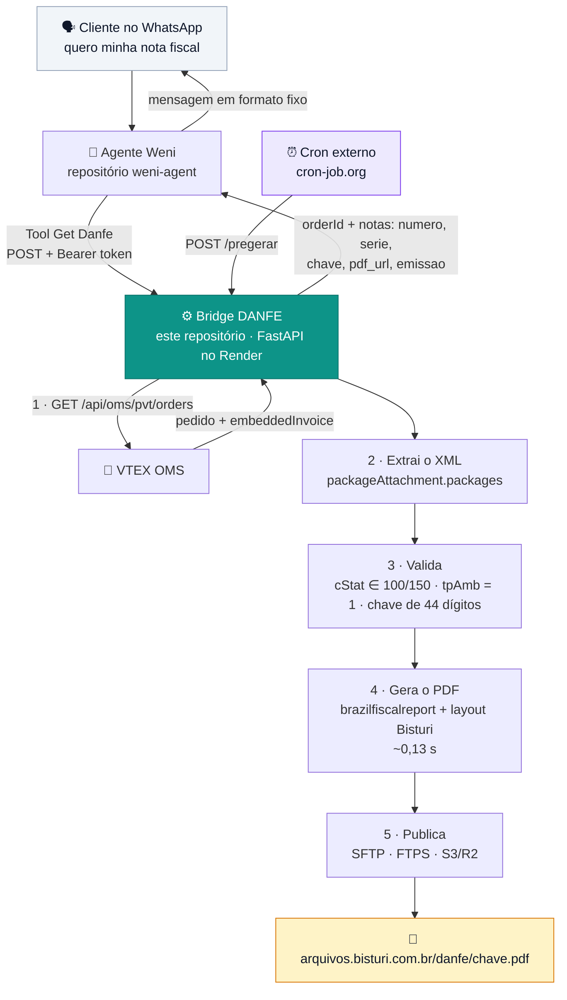
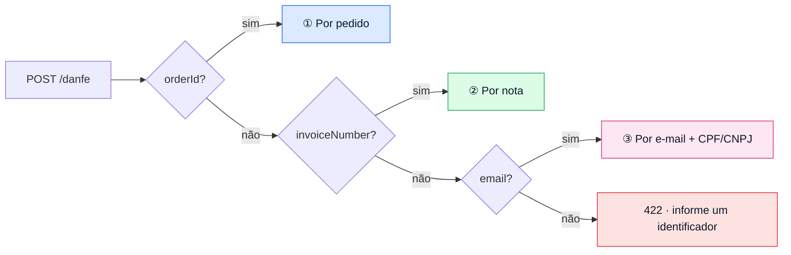
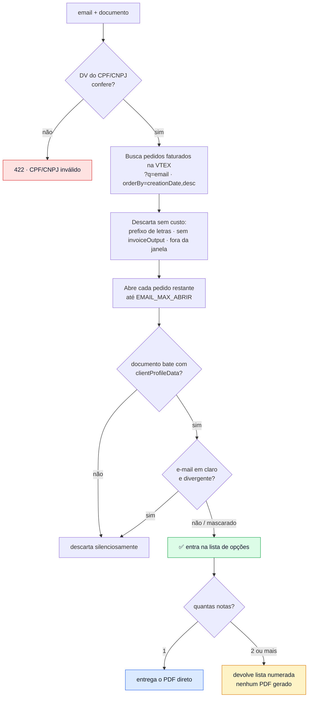
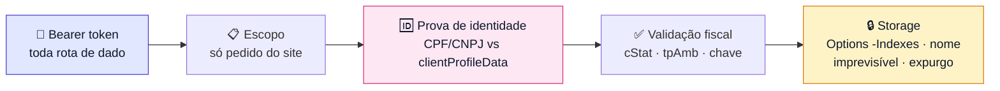

<div align="center">

# 🧾 Bridge DANFE

**Serviço HTTP que transforma um número de pedido, de nota ou um e-mail em um link de PDF da nota fiscal.**

Feito para atendimento passivo no WhatsApp: o cliente pede a nota, o agente consulta, o cliente recebe o link — sem atendente humano no meio, sem VPN e sem expor o ERP.

[](https://www.python.org/)
[](https://fastapi.tiangolo.com/)
[](https://pypi.org/project/brazilfiscalreport/)
[-46E3B7?logo=render&logoColor=white)](./README-deploy.md)


</div>

---

## 📑 Sumário

| Seção | O que você encontra |
|---|---|
| [1. Contexto](#1-contexto) | o problema real e por que a solução ficou assim |
| [2. Arquitetura](#2-arquitetura) | o fluxo ponta a ponta, em diagrama |
| [3. Os três caminhos de consulta](#3-os-três-caminhos-de-consulta) | pedido, nota e e-mail — e a precedência entre eles |
| [4. API](#4-api) | endpoints, payloads e o significado de cada status |
| [5. Segurança](#5-segurança) | autenticação, prova de identidade e os limites conhecidos |
| [6. Armazenamento](#6-armazenamento) | SFTP, FTPS e S3/R2 |
| [7. Layout da DANFE](#7-layout-da-danfe) | as customizações visuais e por que existem |
| [8. Configuração](#8-configuração) | todas as variáveis de ambiente |
| [9. Deploy](#9-deploy) | subir o serviço do zero |
| [10. Operação](#10-operação) | cron, pré-geração, expurgo e hibernação |
| [11. Testes](#11-testes) | o que está coberto e como rodar |
| [12. Manutenção](#12-manutenção) | armadilhas ao mexer no código |

---

## 1. Contexto

### O problema

Clientes da **Bisturi Material Hospitalar** pedem a nota fiscal pelo WhatsApp — todos os dias, muitas vezes por dia. Cada pedido consumia um atendente: localizar a compra, achar o XML, gerar o DANFE, mandar o arquivo. Trabalho repetitivo, sem julgamento nenhum envolvido, e com tempo de resposta preso ao horário comercial.

### A decisão que define o projeto

O caminho óbvio seria buscar a nota no **WinThor** (o ERP). Isso exigiria VPN, credenciais do ERP na nuvem e um ponto de exposição novo num sistema que guarda tudo.

Este projeto não faz isso. O XML autorizado da NF-e **já está dentro do pedido da VTEX**, no campo:

```
packageAttachment.packages[].embeddedInvoice
```

Confirmado com pedidos reais. Como consequência:

| | |
|---|---|
| ❌ **Não precisa** | VPN, túnel, credencial do WinThor, exposição do ERP |
| ✅ **Precisa apenas** | uma appKey/appToken de leitura da VTEX |

Toda a arquitetura decorre disso: a bridge é um serviço *stateless* que lê a VTEX, valida o XML, desenha o PDF e publica o arquivo.

### O que "atendimento passivo" impõe ao design

Quem está do outro lado é um cliente em uma conversa de WhatsApp — não um operador treinado. Isso aparece em várias decisões do código, e é o fio condutor para entender o resto deste documento:

- **O cliente raramente tem o número do pedido.** Ele tem o número da nota, ou nem isso — só o e-mail da compra. Daí existirem [três caminhos de consulta](#3-os-três-caminhos-de-consulta).
- **Erro técnico não pode virar resposta técnica.** Cada status HTTP é escolhido para que o agente saiba *o que dizer* (ver a [tabela de status](#status-e-o-que-cada-um-significa)).
- **Nunca mandar o cliente conferir um dado que está certo.** Mais de um terço dos números de nota da Bisturi pertence a marketplace (Amazon, Rede) — a numeração é uma sequência única, sem separação por canal. Se esses casos fossem tratados como "não encontrado", o cliente conferiria o número, digitaria igual e receberia a mesma resposta. Por isso a bridge distingue *"esse número não existe"* de *"esse número existe, mas é de outro canal de venda"*.
- **Entregar nota fiscal é entregar dado pessoal.** O DANFE tem nome, endereço, CPF e itens comprados. E-mail é um dado que qualquer pessoa digita — logo, e-mail nunca autoriza a entrega por si só.

---

## 2. Arquitetura



### Os dois repositórios

| Repositório | Papel | Onde roda |
|---|---|---|
| **`weni-pdf`** *(este)* | a bridge: VTEX → validação → PDF → URL | Render (container Python) |
| **`weni-agent`** *(irmão)* | o agente e a tool `Get Danfe`: traduz status HTTP em frase para o cliente | plataforma Weni |

A separação é deliberada: **a bridge não escreve texto para cliente e o agente não sabe gerar PDF.** A bridge devolve dado estruturado e um status; a tool decide a frase. Trocar o texto de atendimento nunca exige mexer na geração de nota fiscal.

### Cache implícito, sem banco de dados

O nome do arquivo no storage **é a chave de acesso da NF-e**. Isso dispensa qualquer banco:

```
33260132561144000103550500003724571000000000.pdf
└┬┘└─┬┘└──────┬─────┘└┬┘└┬┘└───┬───┘└┬┘└──┬──┘└┬┘
cUF AAMM     CNPJ    mod série número tpEmis cNF DV
[0:2][2:6]  [6:20] [20:22][22:25][25:34][34][35:43][43]
```

Consequências diretas, todas exploradas pelo código:

- **Nota já publicada** → responde sem tocar na VTEX (`ja_existe()` → `url_publica()`).
- **Consulta por número de nota** → o número é lido do próprio nome do arquivo (`nnf_da_chave()`, `serie_da_chave()`), zero chamadas HTTP.
- **Reinício do container** → nada se perde: o estado está no storage, não em memória.

---

## 3. Os três caminhos de consulta

Um único endpoint, `POST /danfe`, aceita três identificadores. A precedência vai **do mais específico para o mais amplo** — um pedido aponta uma compra; uma nota aponta um documento; um e-mail aponta um cliente, que pode ter várias notas.



<br/>

### ① Por pedido — `orderId`

O caminho mais direto. Gera a nota mesmo que o PDF ainda não exista.

```
orderId → GET pedido na VTEX → extrai XML → valida → PDF → upload → URL
```

Só aceita **pedido do site**: o padrão `\d+-\d+` (ex.: `1600000000000-01`). Pedido com prefixo de letras (`PGM-…`, `MZN-…`) é de outra operação e recebe **400** — não é erro técnico, é "fora do escopo".

> A regra é *"não tem letra nenhuma"*, não *"não tem três letras"*: se amanhã aparecer um prefixo de duas ou quatro letras, continua valendo.

### ② Por nota — `invoiceNumber` *(+ `serie` opcional)*

O identificador que o cliente costuma ter em mãos. Duas tentativas, em ordem de custo:

1. **Acervo publicado** — varre os nomes de arquivo no storage. Custo: uma listagem de pasta. Nenhuma chamada à VTEX.
2. **Busca na VTEX** — se o PDF não existe, descobre o pedido pela busca livre (`?q=`) e gera na hora.

A busca livre da VTEX é aproximada e pode devolver pedido que não corresponde. Por isso o código **confirma a correspondência** contra o campo `invoiceOutput` da própria resposta antes de aceitar qualquer pedido. Sem essa conferência, o risco seria entregar a nota de outro cliente.

O resultado é separado em dois grupos — `(do_site, fora_do_escopo)` — para que a resposta distinga o número inexistente do número de marketplace.

### ③ Por e-mail — `email` + `documento`

Para o cliente que não tem nota nem pedido. **O e-mail é a chave de busca; o CPF/CNPJ é a prova de identidade.**



Quatro detalhes que não devem ser afrouxados:

- **O DV do CPF/CNPJ é conferido antes de qualquer chamada HTTP.** Um documento com dígito errado nunca bateria com pedido nenhum — a consulta seria desperdício. E *"confira o CPF/CNPJ"* é uma resposta muito mais útil ao cliente do que *"não encontrei nada"*.
- **A conferência do documento é feita pedido por pedido**, contra `clientProfileData`. É ela que autoriza a entrega — não o e-mail.
- **E-mail mascarado não invalida nada.** Parte dos pedidos vem com `@ct.vtex.com.br`; comparar esse valor não significaria coisa alguma. Nesses casos vale só o documento, que é conferência exata de qualquer forma.
- **Com várias notas, nenhum PDF é gerado.** A resposta é só metadado (número, data, valor). O PDF sai depois, quando o cliente escolher, pelo caminho ②. Gerar 8 PDFs de uma vez no plano free do Render seria lento sem necessidade.

---

## 4. API

Base URL de produção: `https://bridge-danfe.onrender.com`

| Método | Rota | Auth | Para quê |
|---|---|:---:|---|
| `POST` | `/danfe` | 🔒 | consulta e entrega da nota |
| `GET` `POST` | `/pregerar` | 🔒 | varredura que pré-gera notas recentes |
| `GET` | `/health` | — | liveness probe / keep-alive |

🔒 = header `Authorization: Bearer <BRIDGE_TOKEN>`

<br/>

### `POST /danfe`

<details open>
<summary><b>Requisição</b></summary>

```jsonc
{
  "orderId":       "1600000000000-01",  // caminho ① — precedência máxima
  "invoiceNumber": "372457",            // caminho ② — ou filtra a nota do pedido
  "serie":         "50",                // opcional, desempata número repetido
  "email":         "cliente@empresa.com.br", // caminho ③
  "documento":     "32.561.144/0001-03"      // obrigatório junto com email
}
```

Pelo menos um caminho é obrigatório. Com `orderId` **e** `invoiceNumber` juntos, o `orderId` manda e o `invoiceNumber` apenas filtra qual nota do pedido devolver.

</details>

<details open>
<summary><b>Resposta — nota entregue (200)</b></summary>

```json
{
  "orderId": "1600000000000-01",
  "notas": [
    {
      "numero": "372457",
      "serie": "50",
      "chave": "33260132561144000103550500003724571000000000",
      "pdf_url": "https://arquivos.bisturi.com.br/danfe/33260132561144000103550500003724571000000000.pdf",
      "emissao": "28/08/2026"
    }
  ]
}
```

`notas` é uma **lista** porque um pedido pode ter várias notas (entrega parcial).
`orderId` vem `null` quando a consulta foi por número de nota: a chave não carrega o número do pedido.
`emissao` vem `null` quando a nota veio do acervo publicado — a chave carrega ano e mês, não o dia.

</details>

<details>
<summary><b>Resposta — várias notas para escolher (200)</b></summary>

```json
{
  "email": "cliente@empresa.com.br",
  "notas": [],
  "opcoes": [
    { "numero": "372457", "orderId": "1600000000001-01", "data_pedido": "28/08/2026", "valor": "R$ 1.234,56" },
    { "numero": "372206", "orderId": "1600000000002-01", "data_pedido": "21/08/2026", "valor": "R$ 890,00" }
  ]
}
```

`notas` e `opcoes` nunca vêm vazios ao mesmo tempo: nesse caso a resposta é 404 ou 409, não 200.

</details>

#### Status, e o que cada um significa

Os status **não são decorativos** — cada um mapeia para uma conduta diferente do agente.

| Status | Situação | O agente deve |
|:---:|---|---|
| **200** | nota encontrada, ou lista de opções | enviar a `mensagem` como veio |
| **400** | pedido/nota **existe**, mas não é do site (marketplace, PGM) | devolver ao fluxo principal — **nunca** mandar conferir o número |
| **401** | token ausente ou errado | falha de configuração; não tem retry |
| **404** | não localizado nos caminhos tentados | pedir para conferir o dado informado |
| **409** | pedido existe, nota **ainda não emitida** | explicar que a nota sai no faturamento — não é erro |
| **422** | falta parâmetro, CPF/CNPJ inválido ou XML inválido | pedir o dado que falta |
| **500** | falha ao gerar o PDF | escalar para atendente |
| **502** | a VTEX respondeu erro | escalar para atendente |

> **409 e 400 são os dois que mais importam.** Ambos representam requisições perfeitamente válidas cuja resposta não é um PDF. Tratá-los como "erro" produziria a pior experiência possível: um cliente conferindo indefinidamente um dado que está correto.

<br/>

### `GET|POST /pregerar`

Varredura idempotente: gera no storage o DANFE das notas faturadas que ainda não têm PDF.

```bash
curl -X POST "https://bridge-danfe.onrender.com/pregerar?limite=20&dias=3" \
  -H "Authorization: Bearer $BRIDGE_TOKEN"
```

| Parâmetro | Default | Efeito |
|---|:---:|---|
| `limite` | `PREGERAR_LIMITE` (20) | máximo de notas geradas por execução |
| `dias` | `PREGERAR_DIAS` (3) | quantos dias para trás considerar |

<details>
<summary><b>Resposta</b></summary>

```json
{
  "geradas": [{ "pedido": "1600000000000-01", "nota": "372457", "chave": "3326…1292" }],
  "ja_existiam": 12,
  "sem_nota": 3,
  "fora_do_escopo": 7,
  "consultados": 15,
  "erros": [],
  "memoria": 34
}
```

</details>

Três propriedades que fazem essa rota ser segura de agendar:

- **Idempotente** — o que já existe é apenas contado. Rode quantas vezes quiser.
- **Tolerante a falha** — um pedido problemático entra em `erros` e o lote continua. Se uma execução falhar, a próxima conserta.
- **Keep-alive útil** — mantém a instância acordada fazendo trabalho real, em vez de bater num `/health` vazio.

O campo `memoria` é o tamanho do cache `_PREGERADOS` (orderIds já resolvidos nesta instância), que evita reconsultar o mesmo pedido a cada varredura. Ele se perde no reinício do container, e isso é inofensivo: a execução seguinte apenas confere de novo.

---

## 5. Segurança

### Camadas



### Validação fiscal — antes de gerar, não depois

`validar_xml()` recusa o XML se:

| Checagem | Por que importa |
|---|---|
| `cStat ∈ {100, 150}` | nota rejeitada ou denegada não deve virar DANFE |
| `tpAmb == 1` | XML de homologação sairia com tarja **"SEM VALOR FISCAL"** |
| chave com 44 dígitos | garante que a chave serve como nome de arquivo e é decodificável |
| `infNFe` presente | XML truncado ou de outro documento é recusado |

### Nenhuma credencial no repositório

Todo segredo entra por variável de ambiente. No `render.yaml` eles estão marcados com `sync: false` — o Render pede o valor na interface, na criação do serviço, e o valor nunca toca o Git.

### 🚫 Nenhuma chave de acesso real no repositório

**Este repositório é público.** E o nome do arquivo no storage **é** a chave de acesso da NF-e, sobre uma URL base também pública (`PUBLIC_BASE_URL`).

A conta é direta: uma chave real em qualquer arquivo versionado — teste, comentário, exemplo de README — **é uma URL de DANFE real montável por qualquer pessoa**, e o DANFE traz nome, endereço, CPF e itens comprados do cliente.

> Não adianta o PDF já ter sido expurgado: a bridge **regenera sob demanda**. Uma chave publicada hoje volta a resolver na próxima vez que aquela nota for pedida.

Por isso a regra, que vale para código, teste e documentação:

| | |
|---|---|
| ❌ **Nunca** | chave de acesso real, DANFE em PDF, XML de nota, orderId real |
| ✅ **Sempre** | chave sintética, construída no layout do padrão com `cNF` e DV zerados |

Uma chave sintética preserva o valor do teste — as posições continuam sendo exercitadas — e é inútil como URL, porque não corresponde a documento nenhum. O modelo está em [`testes/teste_email.py`](testes/teste_email.py), junto com o comentário que explica o porquê.

O [`.gitignore`](.gitignore) cobre a parte automática: `.env`, chaves privadas, `*.pdf` e `*.xml` não entram nem por acidente.

### ⚠️ Limitação conhecida: o link do SFTP não expira

Não existe URL assinada em hospedagem compartilhada. O arquivo fica acessível a quem tiver o link, indefinidamente. E o DANFE contém **nome, endereço, CPF e itens comprados**.

Três mitigações, e as três são necessárias juntas:

| # | Mitigação | Status |
|:---:|---|---|
| 1 | Nome do arquivo é a chave da NF-e — inclui `cNF`, 8 dígitos aleatórios. Não é adivinhável por tentativa. | automático |
| 2 | **`.htaccess` com `Options -Indexes` na pasta.** Sem isso, qualquer pessoa abre `/danfe/` e vê a lista de todas as notas — e aí o nome imprevisível não protege nada. | ⚠️ **manual, obrigatório** |
| 3 | `expurgar_antigos(7)` por cron — reduz a janela em que cada nota fica acessível. Se o cliente pedir depois, a bridge regenera. | agendar |

> Onde houver S3/R2 disponível, prefira: `_s3_url()` gera URL assinada com expiração (`URL_EXPIRA_SEGUNDOS`, default 7 dias) e a limitação desaparece.

### Upload atômico

O PDF é gravado com sufixo `.part` e só então renomeado. Sem isso, um cliente que pedisse a nota no exato instante do upload poderia baixar um PDF pela metade.

---

## 6. Armazenamento

Três back-ends, selecionados por `STORAGE_BACKEND`. A interface usada pelo endpoint — `ja_existe()`, `url_publica()`, `subir_pdf()`, `listar_chaves()` — é a mesma para os três.

| Backend | Quando usar | URL assinada | Conexão reaproveitada |
|---|---|:---:|:---:|
| **`sftp`** | hospedagem Umbler (**em produção**) | ❌ | — |
| **`ftps`** | Umbler quando o SFTP não está disponível | ❌ | ✅ (lote da varredura) |
| **`s3`** | Cloudflare R2 ou S3 — **recomendado** | ✅ | — |

<details>
<summary><b>Detalhes de implementação</b></summary>

- **FTPS** usa `_FTPSReuse`, que reaproveita a sessão TLS no canal de dados — exigência de muitos servidores FTPS. Modo passivo é obrigatório saindo de container.
- **`/pregerar` com FTPS** abre **uma** conexão para o lote inteiro, em vez de uma por arquivo. Os helpers aceitam `conn=None` justamente para permitir isso.
- **`expurgar_antigos()`** hoje só está implementado para `sftp`; nos outros back-ends devolve `0`.

</details>

---

## 7. Layout da DANFE

O PDF sai no formato do ERP da Bisturi, não no padrão da biblioteca. Isso é feito com uma subclasse (`DanfeBisturi`) e a substituição de duas classes internas no módulo — herdando as ~112 linhas de geometria do cabeçalho em vez de copiá-las.

| Customização | Onde | Motivo |
|---|---|---|
| Cantos arredondados em **todos** os campos | `rect()` | toda caixa da DANFE passa por `Element.render()` → `pdf.rect()`. Um ponto, efeito global. |
| Fonte de conteúdo maior, rótulos intactos | `get_font_size()` | legibilidade no celular. A tabela de produtos fica fora da escala: `NCM` e `UN` são estreitas e o texto quebraria dentro da célula. |
| Quebra de linha após cada `//` | `_get_additional_data_content()` | organiza as informações complementares. O `//` é preservado — nada se perde do texto original. |
| Bloco **DADOS ADICIONAIS** configurável | `_draw_additional_data()` | a lib fixa 20 mm no código. Como produtos ocupam o que sobra da página, aumentar este bloco é o jeito de encolher aquele. |
| Cabeçalho no formato do ERP | `aplicar_cabecalho_erp()` | rótulo *"Identificação do Emitente"*, texto à esquerda, endereço compacto, linhas de Telefone/Fax/E-mail |
| Número da nota sem zeros | `IdentInfoBisturi.render()` | `Nº 371006` em vez de `Nº 000.371.006`. A lib formata com `int(nr_nota):011` e não expõe gancho. |
| Fonte **TIMES** | `gerar_pdf()` | com `COURIER` o texto de consulta de autenticidade transborda e sobrepõe a linha do protocolo |
| Logo reduzida e aparada | `preparar_logo()` | ver abaixo |

### Sobre a logo

Na DANFE a logo ocupa ~30 mm; acima de ~400 px não há ganho visual — só peso no PDF, que **o cliente baixa no celular**. Uma imagem 4000×4000 embutida faz cada nota passar de 1 MB.

`preparar_logo()` achata transparência sobre branco, apara a margem branca (margem sobrando dentro da imagem vira marca menor na nota), redimensiona, reduz a paleta e guarda o resultado em memória.

**Falha aqui nunca derruba a geração:** qualquer problema devolve o caminho original e o PDF sai com a logo grande. É otimização, não requisito.

---

## 8. Configuração

### Obrigatórias

| Variável | Descrição |
|---|---|
| `BRIDGE_TOKEN` | token que o cliente HTTP deve enviar em `Authorization: Bearer` |
| `VTEX_ACCOUNT` | nome da conta VTEX (o que aparece na URL do admin) |
| `VTEX_APP_KEY` | header `X-VTEX-API-AppKey` |
| `VTEX_APP_TOKEN` | header `X-VTEX-API-AppToken` |

### VTEX e storage

| Variável | Default | Descrição |
|---|:---:|---|
| `VTEX_ENVIRONMENT` | `vtexcommercestable` | ambiente da API |
| `STORAGE_BACKEND` | `sftp` | `sftp` · `ftps` · `s3` |
| `SFTP_HOST` | — | host do storage |
| `SFTP_PORT` / `FTPS_PORT` | `22` / `21` | porta |
| `SFTP_USER` | — | usuário |
| `SFTP_PASSWORD` | — | senha *(ou use `SFTP_KEY_PATH`)* |
| `SFTP_KEY_PATH` | — | caminho da chave RSA, alternativa à senha |
| `SFTP_BASE_DIR` | `/public_html/danfe` | pasta de destino |
| `PUBLIC_BASE_URL` | `https://arquivos.bisturi.com.br/danfe` | prefixo das URLs públicas |
| `R2_ACCOUNT_ID` · `R2_BUCKET` · `R2_ACCESS_KEY_ID` · `R2_SECRET_ACCESS_KEY` | — | só no backend `s3` |
| `S3_ENDPOINT_URL` | *(derivado do R2)* | endpoint alternativo |
| `URL_EXPIRA_SEGUNDOS` | `604800` | validade da URL assinada (7 dias) |

### Consulta por e-mail

| Variável | Default | Descrição |
|---|:---:|---|
| `EMAIL_JANELA_DIAS` | `180` | janela de histórico; pedido mais antigo não entra |
| `EMAIL_MAX_ABRIR` | `20` | quantos pedidos podem ser abertos na VTEX para conferir o documento — **é este número que define o tempo do pior caso** |
| `EMAIL_MAX_OPCOES` | `8` | quantas notas devolver na lista de escolha |

### Varredura

| Variável | Default | Descrição |
|---|:---:|---|
| `PREGERAR_LIMITE` | `20` | notas geradas por execução |
| `PREGERAR_DIAS` | `3` | dias para trás na listagem |

### Aparência da DANFE

| Variável | Default | Descrição |
|---|:---:|---|
| `LOGO_PATH` | — | caminho do arquivo de logo; sem ela o PDF sai sem marca |
| `LOGO_MAX_PX` | `400` | lado máximo em pixels |
| `LOGO_CORES` | `64` | nº de cores na paleta; `0` desliga a redução |
| `LOGO_APARAR` | `1` | apara a margem branca em volta da marca |
| `CABECALHO_ERP` | `1` | `0` volta ao cabeçalho da biblioteca |
| `EMIT_EMAIL` | *(vazio)* | e-mail do emitente — **não existe no XML da NF-e**, vem do cadastro |
| `EMIT_FAX` | *(vazio)* | vazio repete o telefone, que é o que o ERP faz hoje |
| `DANFE_RAIO_CANTO` | `1.2` | raio do canto das caixas, em mm; `0` = cantos retos |
| `DANFE_FATOR_FONTE` | `1.18` | multiplicador da fonte de conteúdo. **`1.35` transborda a margem direita; `1.18` é o limite testado.** |
| `DANFE_ALTURA_CAMPO` | `7.0` | altura da caixa de cada campo, em mm (padrão da lib: 6) |
| `DANFE_ALTURA_ADICIONAIS` | `55.0` | altura do bloco DADOS ADICIONAIS, em mm (padrão da lib: 20) |

---

## 9. Deploy

### Local

```bash
python -m venv .venv && .venv\Scripts\activate     # Windows
pip install -r requirements.txt
uvicorn bridge_danfe:app --host 0.0.0.0 --port 8080
```

Docs interativas em `http://localhost:8080/docs` (FastAPI/Swagger).

### Render — via Blueprint

O `render.yaml` deste repositório configura o serviço sozinho.

```
Dashboard → New → Blueprint → aponte para este repositório
```

O Render lê o arquivo e pede os 5 valores marcados como secretos: `BRIDGE_TOKEN`, `SFTP_PASSWORD`, `VTEX_ACCOUNT`, `VTEX_APP_KEY`, `VTEX_APP_TOKEN`.

### Passo obrigatório no Umbler

**Antes** de qualquer coisa, suba o [.htaccess](.htaccess) em `/public_html/danfe/`. Sem `Options -Indexes`, a pasta de notas fiscais fica listável publicamente.

### Validação ponta a ponta

```bash
# 1 · serviço no ar
curl https://bridge-danfe.onrender.com/health
#  → {"status":"ok"}

# 2 · pedido real que sabemos ter nota
curl -X POST https://bridge-danfe.onrender.com/danfe \
  -H "Authorization: Bearer $BRIDGE_TOKEN" \
  -H "Content-Type: application/json" \
  -d '{"orderId":"1600000000000-01"}'
#  → {"orderId":"…","notas":[{"numero":"…","serie":"50","chave":"…","pdf_url":"https://…"}]}
```

Abra a `pdf_url` no navegador. Se o DANFE aparecer, o risco técnico acabou — o que resta é integração de fluxo na Weni.

> Detalhes completos, incluindo o passo do Umbler: **[README-deploy.md](./README-deploy.md)**

---

## 10. Operação

### ⏰ Hibernação do plano free — leia antes de ir para produção

O plano free do Render **hiberna o serviço após ~15 min sem tráfego**. A primeira chamada depois disso leva **30 a 50 segundos** para responder, porque o container precisa subir.

Para atendimento isso é ruim: o cliente pede a nota e espera quase um minuto sem entender por quê.

| Abordagem | Efeito |
|---|---|
| **Cron em `/pregerar`** *(recomendado)* | mantém acordado **e** adianta as notas do dia. Agende só no horário de atendimento — as horas gratuitas do Render são finitas. |
| **Mensagem de espera no fluxo** | *"só um instante, estou buscando sua nota"*. Não resolve a lentidão, mas evita a sensação de travamento. Vale fazer de qualquer forma. |
| **Migrar quando incomodar** | Cloud Run não tem esse problema e a cota gratuita cobre este volume folgadamente. O `bridge_danfe.py` roda igual nos dois — só o passo de deploy muda. |

> **Gerar o PDF leva ~0,13 s.** O processamento nunca é o gargalo; o único atraso relevante é o cold start.

### Rotinas sugeridas

| Rotina | Frequência | Comando |
|---|---|---|
| Pré-geração + keep-alive | 10 min, em horário comercial | `POST /pregerar` com o Bearer token |
| Expurgo de PDFs antigos | diário | `expurgar_antigos(7)` |

O expurgo é o que compensa o link do Umbler não expirar. Se o cliente pedir a nota depois de o arquivo ter sido apagado, a bridge regenera na hora — o custo é ~0,13 s.

---

## 11. Testes

Dois arquivos, ambos **sem rede e sem credencial**: a VTEX e o `requests` são substituídos por dublês.

```bash
python testes/teste_email.py    # a bridge
python testes/teste_tool.py     # a tool do agente
```

### `testes/teste_email.py` — a bridge

Cobre a parte onde um erro vazaria dado de cliente:

| # | O que fica provado |
|:---:|---|
| 1 | pedido de **outro CNPJ nunca entra na lista**, mesmo tendo vindo na busca |
| 2 | pedido com prefixo de letras é descartado |
| 3 | pedido sem `invoiceOutput` é descartado |
| 4 | pedido fora da janela **corta a varredura** (a lista vem em ordem decrescente) |
| 5 | e-mail mascarado pela VTEX não invalida um documento que bate |
| 6 | e-mail em claro divergente **invalida** o pedido |
| 7 | CNPJ em `corporateDocument` também vale |
| 8 | um pedido que não abre na VTEX não derruba a busca inteira |
| 9 | os tetos `EMAIL_MAX_ABRIR` e `EMAIL_MAX_OPCOES` são respeitados |
| 10 | nenhum pedido descartado por regra local chega a ser aberto na VTEX |
| 11 | `buscar_pedidos_por_nota` separa site de marketplace, e ignora zeros à esquerda |
| 12 | `nnf_da_chave` / `serie_da_chave` decodificam uma **chave real** corretamente |

### `testes/teste_tool.py` — a tool

Injeta stubs do SDK `weni` e programa respostas da bridge. Cobre a precedência dos três caminhos, a tradução de cada status em `motivo`, o formato exato das mensagens, o retry em 5xx e a ausência de retry em 4xx.

Duas regressões merecem destaque por serem erros de produto, não de código:

- **A mensagem de marketplace precisa afirmar que o número está correto** — o teste falha se a frase contiver "confira".
- **Dois documentos com o mesmo número escalonam para humano**, não perguntam a série. Quem pede a nota é justamente quem não tem o documento em mãos para olhar a série.

> A tool vive no repositório irmão `weni-agent`. Aponte outro caminho com `WENI_AGENT_DIR=…` se a pasta não for irmã desta.

---

## 12. Manutenção

### 📁 Estrutura

```
weni-pdf/
├── bridge_danfe.py       ⭐ o serviço inteiro — ~1.490 linhas, uma unidade
├── requirements.txt         versões efetivamente testadas
├── render.yaml              blueprint do Render
├── .htaccess                vai no Umbler, não aqui
├── logo.png                 marca embutida na DANFE (via LOGO_PATH)
├── README-deploy.md         passo a passo do deploy
└── testes/
    ├── teste_email.py       bridge — consulta por e-mail, nota e chave
    └── teste_tool.py        tool do agente — precedência e mensagens
```

### 🔒 Por que `brazilfiscalreport` está fixado em 1.0.2

O layout customizado **sobrescreve métodos internos da biblioteca** (`_draw_additional_data`, `get_font_size`, `rect`, `_get_additional_data_content`), **substitui duas classes no módulo** (`DanfeEmitInfo`, `DanfeIdentInfo`) e **troca a constante `DEFAULT_FIELD_HEIGHT` em dois pontos de import**.

> ⚠️ Subir de versão pode **quebrar o visual sem quebrar o serviço** — o PDF sai, válido, com o layout errado. Nenhum teste pega isso. **Gere um PDF de teste e olhe antes de subir.**

O mesmo vale para `paramiko`: é o núcleo do upload.

### Pontos de atenção conhecidos

- **`listar_chaves()` e `_ftps_listar()`** usam `/public/danfe` como default de `SFTP_BASE_DIR`, enquanto `_sftp_remote_path()` usa `/public_html/danfe`. Como a variável está sempre definida em produção, a divergência não aparece — mas vale unificar antes que apareça.
- **`expurgar_antigos()`** devolve `0` em qualquer backend que não seja `sftp`. Ao migrar para S3/R2, implemente o equivalente.
- **`_PREGERADOS`** é memória de processo. Com mais de uma instância, cada uma tem a sua — inofensivo, porque a varredura é idempotente.
- **`EMIT_EMAIL` e `EMIT_FAX`** não existem no XML da NF-e. O fax não é campo do padrão e o e-mail vem do cadastro, não da nota.

---

<div align="center">

**Bisturi Material Hospitalar** · integração VTEX ↔ Weni
Nenhuma credencial neste repositório — tudo por variável de ambiente.

</div>
